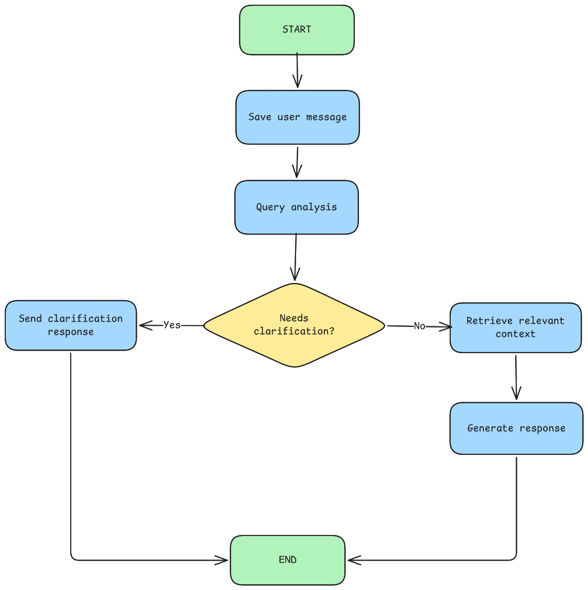

# Тестовое задание на стражировку в СДЕК
Направление LLM-инженер

### Локальная разработка

Убедитель что на вашей системе установлен пакетный менеджер [uv](https://docs.astral.sh/uv/#installation)

Выполните следующие команды:
```bash
uv venv --python 3.13
uv install
uv run prek install
```

Настройка переменных окружения производится в файле .env.
Список переменных:
```bash
DATA_DIR=data # Папка с документами для RAG
# Убедитесь, что указанная папка попадет в образ Docker контейнера!

LLM_PROVIDER=openai_compatible # Тип LLM провайдера
# В проекте реализовано два типа провайдеров:
# 1. fake - для тестирования кода (возвращает строку "Тестовый ответ.")
# 2. openai_compatible - для работы с API LLM, реализующих OpenAI совместимый API


LLM_BASE_URL=http://localhost:11434/v1
LLM_API_KEY=ollama
LLM_MODEL=llama3.1
LLM_TEMPERATURE=0.0
LLM_TIMEOUT_SECONDS=60
```

Запуск проекта для локальной разработки:
```bash
uv run fastapi dev src/app/main.py
```

### Развертка проекта (deploy)
```bash
docker-compose up --build -d
```

### Структура графа


### Что дальше?
- Использование БД для персистентности чатов (сейчас все хранится в оперативной памяти)
- Хранение истории чата (с переодическим сжатием)
- Реализовать больше стратегий для LLM сервисов (поддержка других API, провайдеров)
- Анализ запросов не просто по ключевым словам, а через схожесть (чтобы игнорировать опечатки)
- Семантический RAG (с возможностью поддержки большого количества файлов)
  Можно реализовать через embedding модели
- Верификация ответов, чтобы убедиться что LLM опирается на факты
